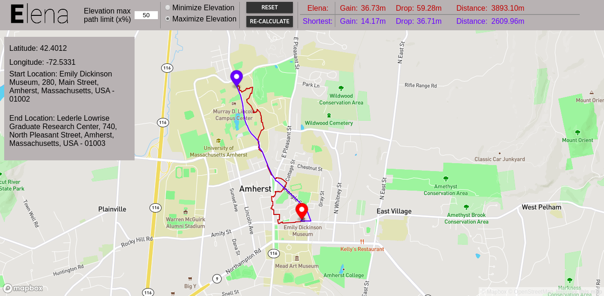

# Elevation Based Navigation System (ELENA)
Elevation-based Navigation (EleNa) is a map based application that gives the user a hiking route between any two points on the map that either minimizes or maximizes the elevation gain and is within “x%” of the shortest path possible where x is user specified.

# Set-up

### Installing OSMnx
with pip:
```
pip install osmnx
```
Note: If you are pip installing OSMnx, install geopandas and rtree first. 

It's easiest to use conda-forge to get these dependencies installed.
with conda:
```
conda install -c conda-forge osmnx
```

### Installing NetworkX
with pip:
```
pip install networkx
```

### Installing GeoPy
with pip:
```
pip install geopy
```

Also verify that other dependencies mentioned in "requirements.txt" are installed.

# Running and testing the application

### Using the application
- Make `start` an executable by running `chmod +x start`
- ```./start``` To start up the application. 
- Head over to `http://127.0.0.1:5000/presentation` on preferably Google Chrome to use the web interface.



- The user clicks on the map to set the start and end point.
- The user also sets the percentage of shortest distance that they are willing to go extra and whether they want to minimize or maximize elevation.
- Clicking on the "Calculate" button would show the shortest and the elevation path. The path statistics are also displayed on the UI
- The user can change percentage or the elevation option and recalculate the route.
- If the user wishes to update the start or end location then the system needs to be reset by clicking the "Reset" button before doing so.

### Back-end Logic
- The algorithm for the elevation route runs the Dijkstra and A-star algorithm. It then choses the best path among the paths returned by each algorithm, based on the elevation requirements.
- The current map is centered around Amherst and we assume that user would query around this area.
- If a user wishes to query in a different location then they need to delete the `graph.p` file and update the UI. The system will then download the new graph object and then work as expected. Note, downloading the graph may take time. The user would also have to generate their own Google Api key to get the elevation data and add that in `Elenav/abstraction/config.py`.

### Testing 
- To run the tests run `python test/test.py` from the home directory.

# Contributors

- `Karishma Jain`
- `Manan Patel`
- `Raj Patel`
- `Megha Narayana`
- `Vishnu Balakrishnan`
